# Ace Data Cloud Langflow 扩展

在 Langflow 1.12.5 及以上版本中使用 Ace Data Cloud 对话模型与服务组件。一个 Extension Bundle 提供命名的 **Ace Data Cloud** 模型 Provider，以及图像、视频、音频、搜索和人脸共 17 类服务的独立组件。示例文件不含密钥。

[English guide](README.md) · [当前模型和价格](https://platform.acedata.cloud/models) · [源码](https://github.com/AceDataCloud/LangflowAceDataCloud)

> **上架状态：** [0.1.0 GitHub Release](https://github.com/AceDataCloud/LangflowAceDataCloud/releases/tag/v0.1.0) 已可用 pip 安装；尚未发布到 PyPI，也未进入 Langflow 默认精选依赖。[Langflow 官方投稿](https://github.com/langflow-ai/langflow/pull/15659)正在审核。

## 1. 安装扩展

请管理员在运行 Langflow 的**同一个 Python 环境**中安装。本地全新环境示例：

```bash
uv venv --python 3.12
source .venv/bin/activate
uv pip install "langflow==1.12.5"
uv pip install "https://github.com/AceDataCloud/LangflowAceDataCloud/releases/download/v0.1.0/lfx_acedatacloud-0.1.0-py3-none-any.whl"
lfx extension list
langflow run
```

也可克隆本仓库后执行 `uv pip install .` 从源码安装。GitHub wheel 是公开包文件，但不等于 PyPI 收录。

现有 Langflow 服务安装后需要重启。打开 `langflow run` 显示的本地地址（通常为 `http://localhost:7860`），在流程中选择 **Components → Ace Data Cloud**。这里有 17 个服务操作和 15 个独立任务查询组件。某台服务器能看到组件，只证明该服务器已经安装扩展。

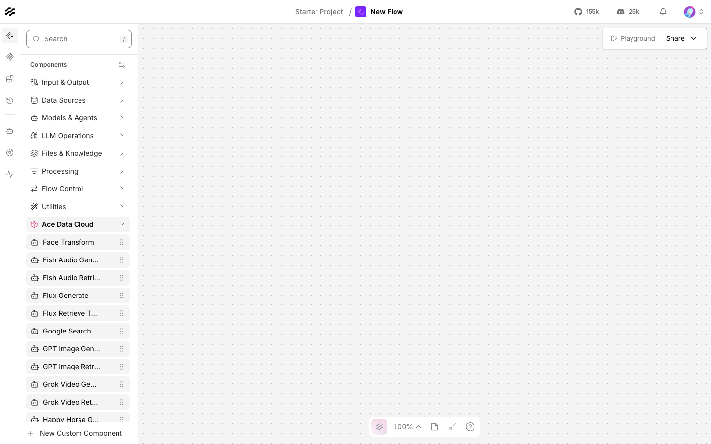

## 2. 获取权限正确的 API Key

1. 登录 [Ace Data Cloud → Applications](https://platform.acedata.cloud/console/applications)。
2. 若要用同一 Key 调用对话模型和多个服务，打开 **General application**。服务专属应用 Key 只能调用对应服务。可以复制现有 Key，也可以进入 **Manage Keys → Create** 新建专用 Key。
3. 发起付费调用前，检查服务权限、当前价格和余额。若启用了 **Allowed APIs** 限制，需同时允许流程使用的提交和任务查询接口。GPT Image 示例需要 `/openai/images/generations` 与 `/openai/tasks`；对话模型示例需要 `/v1/models` 与 `/v1/chat/completions`。
4. 只复制 token 本身，不要加 `Bearer `，也不要填平台管理 token。不要把 Key 写进提示词、流程 JSON、截图或支持工单。

## 3. 在 Langflow 中保存凭据

点击右上角头像 → **Settings → Global Variables → Add New**。**Type** 选 **Credential**，**Name** 填 `ACEDATACLOUD_API_KEY`，在 **Value** 粘贴 Key，然后点 **Save Variable**。保存后的值会打码。

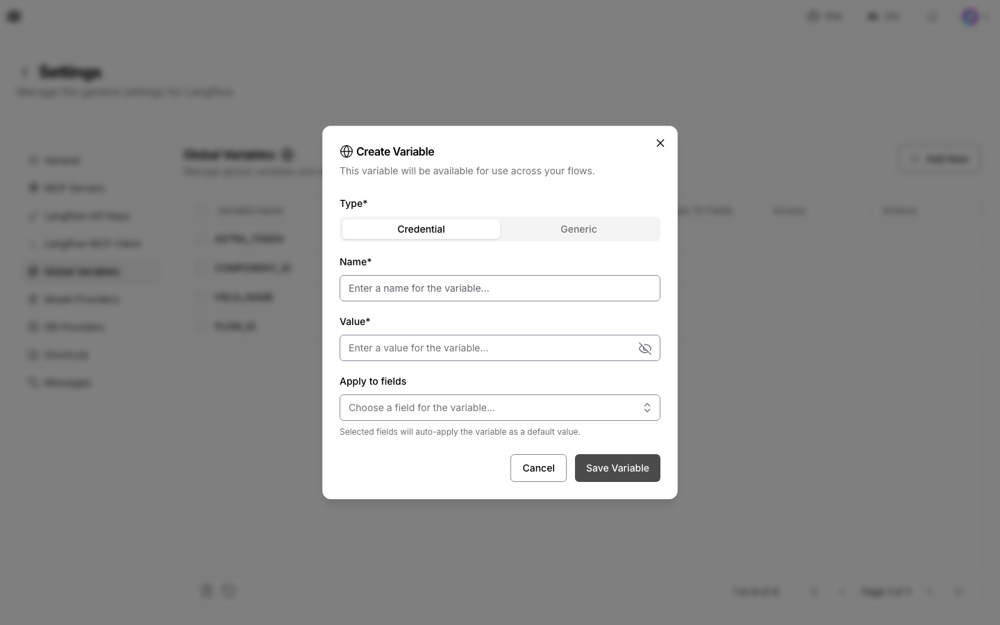

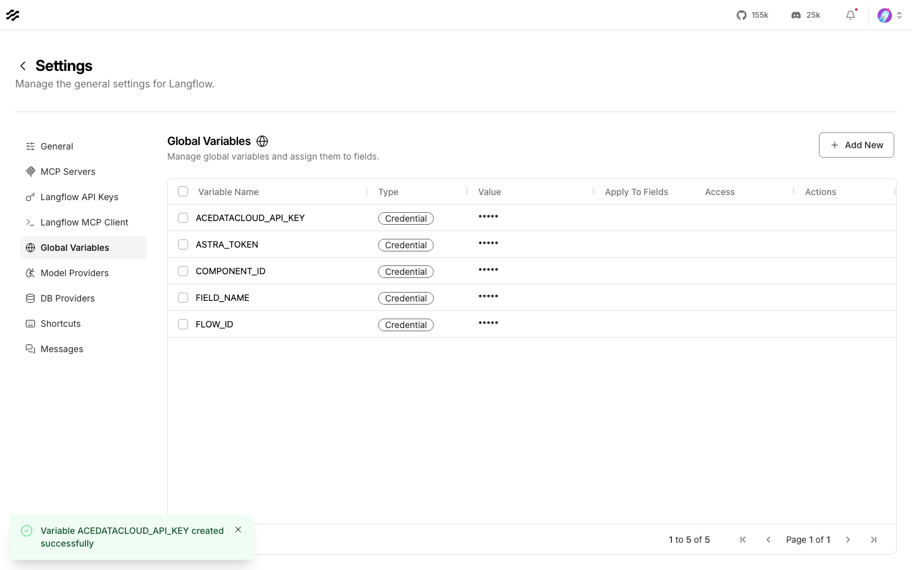

同一个变量也会连接模型 Provider。进入 **Settings → Model Providers → Ace Data Cloud**，确认 API Key 已连接。2026 年 10 月 9 日的测试环境显示 84 个公开对话模型；目录和账号权限可能变化。打开想使用的具体模型。

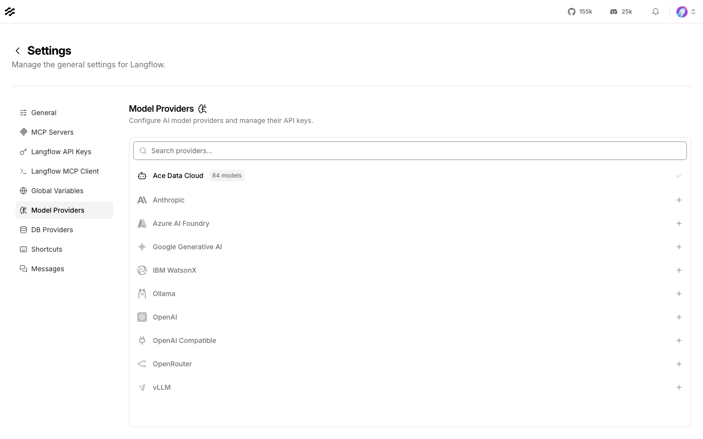

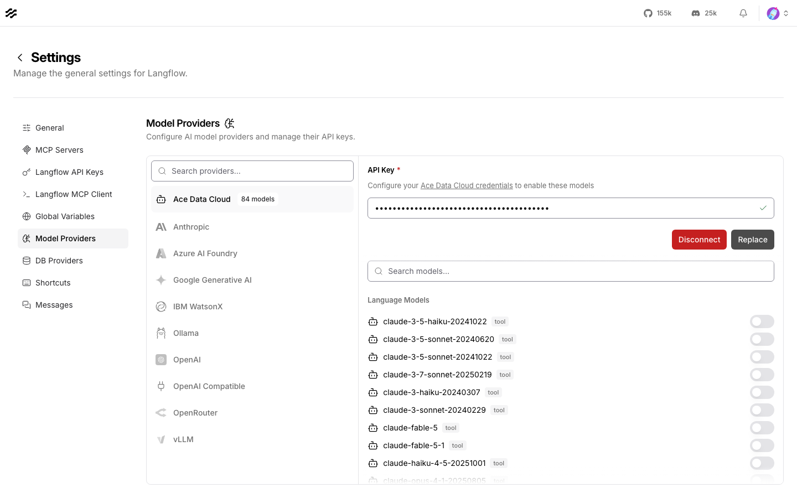

每个服务节点的 **Ace Data Cloud API key** 字段都有地球图标；点击后选择 `ACEDATACLOUD_API_KEY`。GPT Image 首跑流程的 Generate 和 Retrieve Task **都要绑定**。流程保存的是变量名，Key 值存放在 Langflow 的 Credential 全局变量中。分享导出的流程前仍要检查是否混入明文密钥。实测 Langflow 1.12.5 在 `LANGFLOW_REMOVE_API_KEYS=true` 时也会在重新加载时去掉此字段的全局变量引用；要持久绑定请使用默认设置，并重载流程确认引用仍在。

## 4. 首次调用对话模型

在 Projects 页面点 **Upload a flow**，选择 [`examples/chat_model.json`](examples/chat_model.json)。流程把 **Ace Data Cloud → `gpt-4.1-mini`** 的 Language Model 连到 Chat Output，固定输入为 `Reply with exactly OK.`。API Key 覆盖字段留空，使用上一步配置的 Provider 凭据。只点击一次 Chat Output 的 **Run component** 三角按钮，再查看输出或 **Traces**。

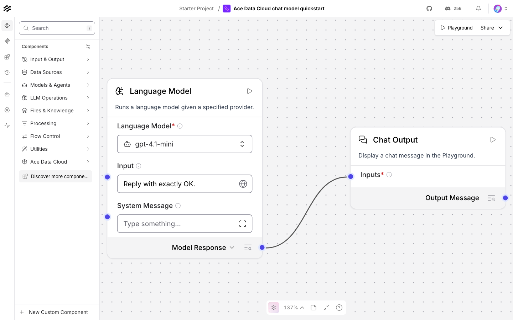

真实测试返回 `OK`，输入 11 tokens、输出 5 tokens。流程追踪与一条对应的 Credits 用量记录均已读回。你的结果和费用取决于当前模型与账号。

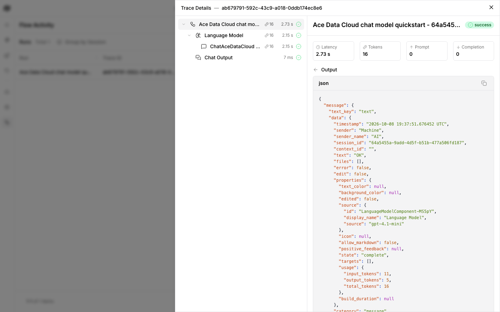

## 5. 生成一张 GPT Image，只查询同一个任务

上传 [`examples/gpt_image.json`](examples/gpt_image.json)。Langflow 1.12.5 成功导入该无密钥文件，显示三节点路径：

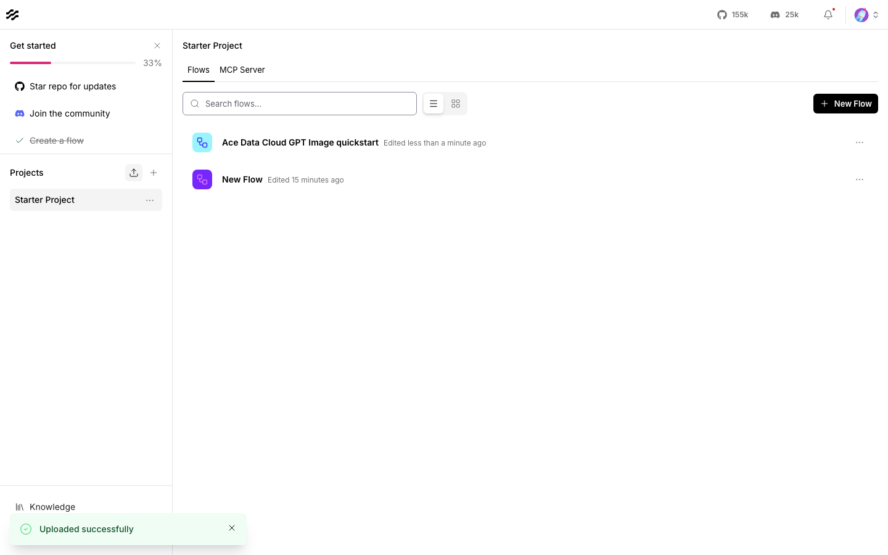

**GPT Image Generate → GPT Image Retrieve Task → Chat Output**

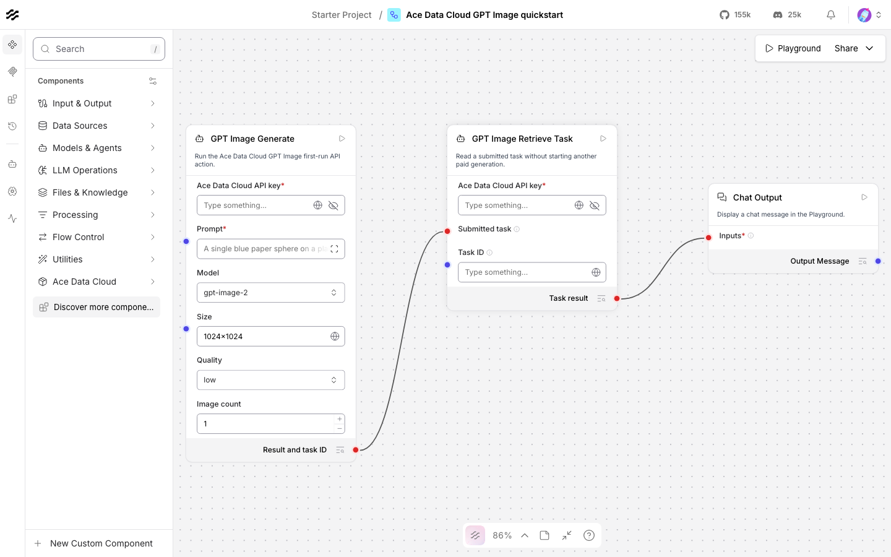

在两个 Ace 节点都绑定 `ACEDATACLOUD_API_KEY`。示例已填好以下首跑参数，其他参数留空：

| 字段 | 值 |
| --- | --- |
| Prompt | `A single blue paper sphere on a plain cream background, clean studio photograph, no text.` |
| Model | `gpt-image-2` |
| Size | `1024x1024` |
| Quality | `low` |
| Image count | `1` |
| Additional route parameters | `{"async": true}` |
| Retrieve Task → Wait up to seconds | `240` |

在编辑器选中 Generate → **Parameters**，对 **Additional route parameters** 点 **Add**，即可看到预填的 `async=true`。提交接口会尽快返回任务 ID，不必等媒体全部生成。

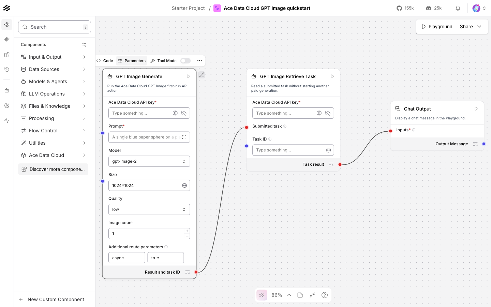

只点击 **Chat Output** 的 **Run component 一次**。Generate 只提交一次付费任务，并请求尽快返回任务 ID；返回的 `task_id` 已连到 Retrieve Task 的 **Submitted task** 输入。查询节点仅调用 `/openai/tasks`，最多等待 240 秒，始终查询同一任务 ID。流程变绿不能单独证明媒体任务已经完成。

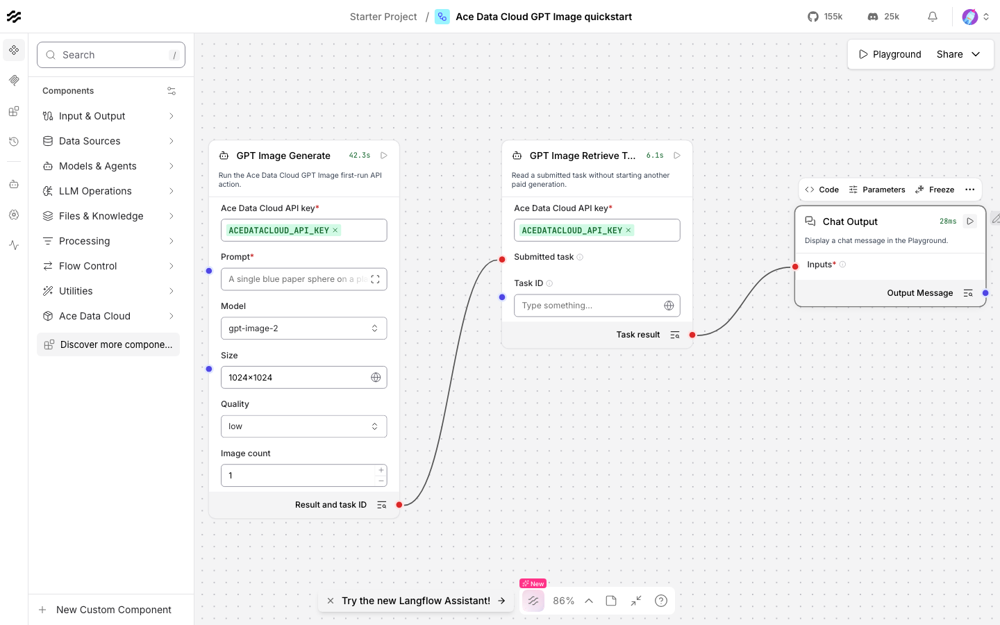

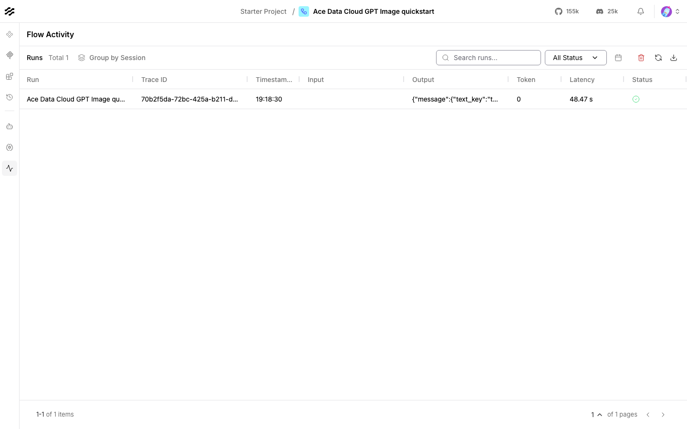

真实测试返回 `status=succeeded`、`success=true`、任务 ID `ac4ffabb-ada6-4689-b275-7e9f9928493a` 和一个 PNG 链接。该媒体已通过 HTTPS 打开，响应为 `200 image/png`。

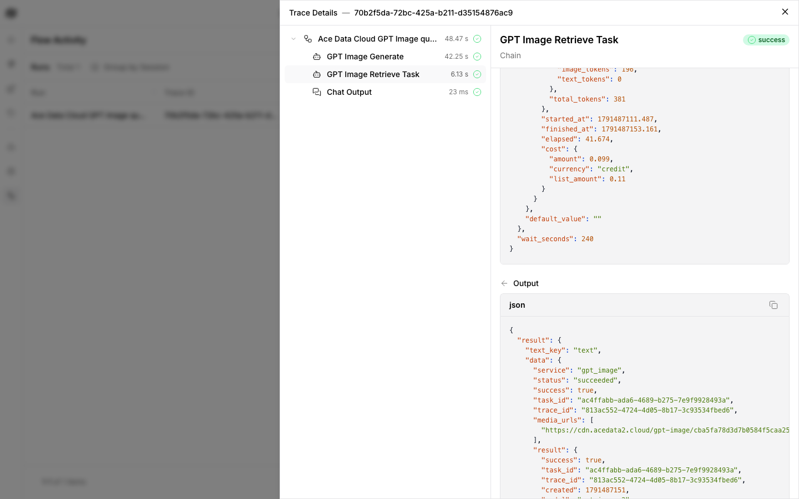


如果状态仍是 `pending`，**不要重跑生成流程**，否则会再次提交付费任务。导入 [`examples/retrieve_only/gpt_image.json`](examples/retrieve_only/gpt_image.json)，绑定同一个 Credential 变量，在 **Task ID** 粘贴原任务 ID，然后运行 Chat Output。这个流程没有生成节点；直到任务结束前，只重复运行此查询流程。

如果提交超时但服务已接收，先查 Usage History，不要再提交。GPT Image、Midjourney、Veo 的任务查询组件还可在未返回任务 ID 时用请求历史中的 **Trace ID** 找回任务；其他服务可从原用量记录找任务 ID，或带 trace ID 联系支持。只查询找回的任务，不要为了解状态而重新生成。

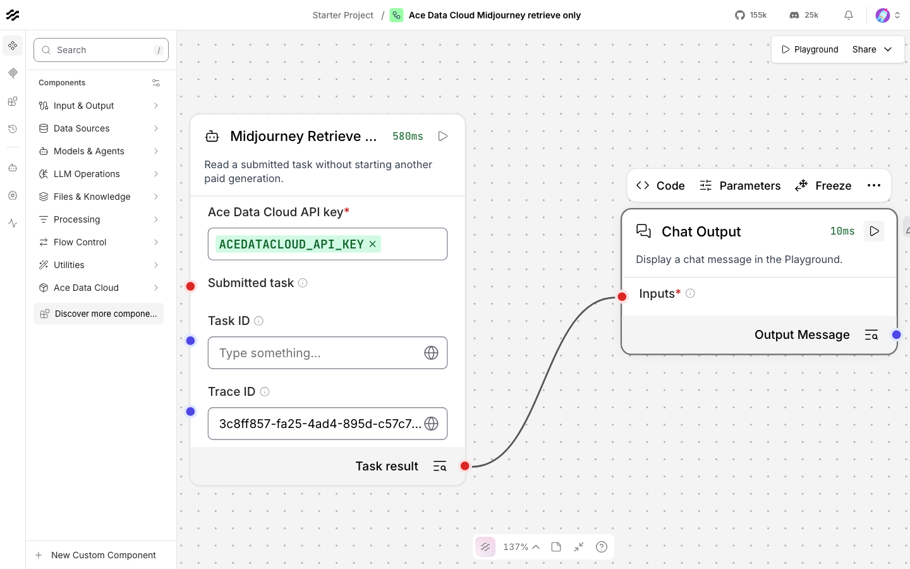

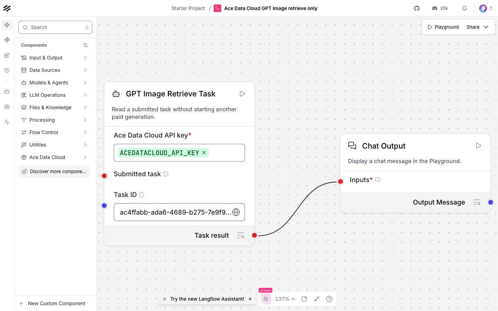

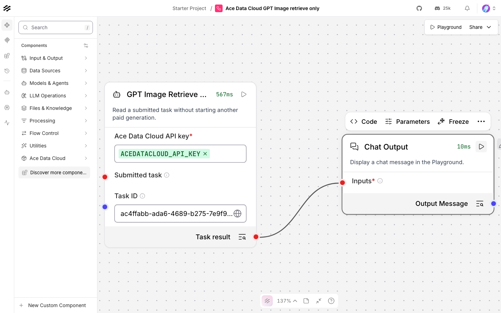

## 6. 核对费用

到 [Ace Data Cloud → Usage History](https://platform.acedata.cloud/console/usages) 按 API、Key 和时间过滤，对照任务或 trace ID。本次 GPT Image 测试的 trace ID 为 `813ac552-4724-4d05-8b17-3c93534fbed6`；平台对该 trace 只查到**一条** HTTP 200 用量记录，扣除 **0.099 Credits**。Langflow 的任务输出也显示 `cost.amount=0.099`、货币为 `credit`。这是该次测试的证据，并非永久价格；如需换算 USD，应读取你当前套餐的单价。

对话模型示例对应一条 `gpt-4.1-mini` 用量记录，共 16 tokens，扣除 `0.0000234636021` Credits。[脱敏验证记录](tests/evidence/) 分别保存任务、媒体、导入和账单读回。

## 其他服务示例

下表每个文件都是无密钥的首跑流程。异步服务旁的 `retrieve_only` 文件只查询已有任务 ID，不再次提交生成。每个命名组件实现所列首跑动作，并提供仅允许该公开接口字段的 **Additional route parameters**。当前版本聚焦这些入口，不宣称覆盖底层 API 的全部高级操作。

15 个异步首跑流程及新添加的媒体组件预填 `{"async": true}`，使查询组件能尽快收到任务 ID。Fish Audio 不设置该选项时也可能同步完成；已完成的结果会直接通过其查询节点，不会再次发 API 请求。

每项的公开接口路径、默认值和验证级别见 [能力清单](CAPABILITIES_zh_CN.md)。

| 服务 | 首跑动作 | 导入流程 | 任务查询 |
| --- | --- | --- | --- |
| GPT Image | 生成一张图 | [流程](examples/gpt_image.json) | [查询](examples/retrieve_only/gpt_image.json) |
| Suno | 生成纯音乐 | [流程](examples/suno.json) | [查询](examples/retrieve_only/suno.json) |
| Seedance | 文生视频 | [流程](examples/seedance.json) | [查询](examples/retrieve_only/seedance.json) |
| Fish Audio | 文本转语音 | [流程](examples/fish_audio.json) | [查询](examples/retrieve_only/fish_audio.json) |
| Seedream | 生成一张图 | [流程](examples/seedream.json) | [查询](examples/retrieve_only/seedream.json) |
| Happy Horse | 文生视频 | [流程](examples/happy_horse.json) | [查询](examples/retrieve_only/happy_horse.json) |
| Qwen Image | 生成一张图 | [流程](examples/qwen_image.json) | [查询](examples/retrieve_only/qwen_image.json) |
| Veo | 文生视频 | [流程](examples/veo.json) | [查询](examples/retrieve_only/veo.json) |
| Google Search | 网页搜索，同步返回 | [流程](examples/google_search.json) | 无任务 ID |
| Grok Video | 文生视频 | [流程](examples/grok.json) | [查询](examples/retrieve_only/grok.json) |
| Face Transform | 人脸关键点分析，同步返回 | [流程](examples/face_transform.json) | 无任务 ID |
| Midjourney | 生成一张图 | [流程](examples/midjourney.json) | [查询](examples/retrieve_only/midjourney.json) |
| Flux | 生成一张图 | [流程](examples/flux.json) | [查询](examples/retrieve_only/flux.json) |
| MiniMax H3 | 文生视频 | [流程](examples/minimax_h3.json) | [查询](examples/retrieve_only/minimax_h3.json) |
| Wan | 文生视频 | [流程](examples/wan.json) | [查询](examples/retrieve_only/wan.json) |
| Kling | 文生视频 | [流程](examples/kling.json) | [查询](examples/retrieve_only/kling.json) |
| Nano Banana | 生成一张图 | [流程](examples/nano_banana.json) | [查询](examples/retrieve_only/nano_banana.json) |

18 个首跑 JSON（1 个模型 + 17 个服务）和 15 个独立查询 JSON 全部已在 Langflow 1.12.5 导入。15 个查询组件先复用了已有完成任务，没有再次生成。随后其余 14 个媒体 Component 类各自仅新发一次付费请求：14 项任务全部完成，首媒体链接均为 HTTP 200，每项各匹配一条 Credits 用量；合计扣费 19.302232 Credits，见[逐服务脱敏证据](tests/evidence/media-generation-live.json)。Midjourney 与 Grok 的原同步提交在服务接收后发生客户端超时；两项均从账单记录找回原任务并完成，未重发付费生成。GPT Image 与对话模型已验证完整导入 UI 流程；其他服务已导入 flow 并真实调用组件方法，但不把它们称为完整 UI 图执行已验证。

## 常见问题

| 现象 | 处理方法 |
| --- | --- |
| 找不到组件分组 | 确认装在 Langflow 的 Python 环境，运行 `lfx extension list`，然后重启服务。 |
| 找不到 Provider 或模型列表为空 | 检查 **Settings → Model Providers**、Credential 全局变量、`/v1/models` 权限与目标模型开关。 |
| 401 或 403 | 核对应用 API Key、Allowed APIs、服务开通、有效期和余额；Key 输入框不要加 `Bearer `。 |
| 400 | 核对准确模型、动作、时长、尺寸及附加参数。组件会固定各首跑动作的公开接口路径。 |
| `pending` 或无媒体 | 用独立查询流程查询同一任务 ID，不要通过重跑 Generate 轮询。 |
| 429 | 等待并降低并发，不要启用自动付费重试。 |
| 超时或 5xx | 先查请求历史与原任务状态，再判断是否需要新提交。支持时可用任务查询组件的 Trace ID 字段。给支持团队提供任务或 trace ID，不提供 Key。 |

## 隐私、范围与开发

扩展把选定输入和 Bearer token 发往 `https://api.acedata.cloud`。密钥应存放在 Langflow 的 Credential 全局变量中。持有生成媒体链接的人可能访问对应产物，分享流程与输出时请留意。扩展本身免费；API 调用遵循当前服务价格与账号余额。参见 [隐私说明](PRIVACY.md)、[问题反馈](https://github.com/AceDataCloud/LangflowAceDataCloud/issues) 或 dev@acedata.cloud。

开发或审核命令：

```bash
uv pip install -e .
lfx extension validate src/lfx_acedatacloud --execute-imports
pytest -q tests
python -m build
```

Manifest 使用公开的 `BUNDLE_API_VERSION=1`，Provider 和组件 ID 独立，在 Langflow 1.12.5 上验证。包可安装、Langflow 上游接纳、默认集成和各服务真实完成应分开记录。
